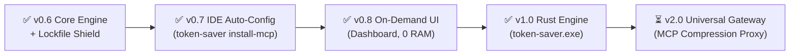

# 🗺️ Token-Saver Strategic Roadmap: From Local Engine to Universal Standard

> **Vision:** Zero-cost, zero-latency token optimization engine and intelligent MCP middleware for AI coding assistants.

---

## 📍 Execution Milestones & Roadmap

---

## 🏆 Completed Milestones (Production Release: v1.0.0)

### ✅ Multi-Language AST Skeletonizer
- Multi-language AST parsing across 14+ languages (Python, TS/JS, Go, Rust, Java, C++, Ruby, PHP, C#, Bash).
- Extracts class signatures, method docstrings, and contracts while pruning implementation bodies.
- **Measured: 80% - 85% token reduction (3-4 ms latency).**

### ✅ Session-Level & Persistent L2 Cache with Semantic Diffing
- First read caches AST and tokens in SQLite WAL mode; subsequent reads detect modifications and return surgical unified diffs.
- Automatic detection of small files to avoid diff bloat.
- **Measured: 91% - 93% token reduction on file re-reads.**

### ✅ Global Symbol Index & Blast Radius Engine
- SQLite FTS-indexed symbol lookup across classes, functions, and methods.
- `find_symbol_references`: Instant caller and import graph discovery across entire repos, eliminating the need to read 6-10 caller files.
- Incremental mtime cache invalidation: unindexed disk scan eliminated.
- **Measured: 94.6% - 96.0% token reduction on refactoring and exploration.**

### ✅ Test & Terminal Output Pruner
- Specialized filters for `cargo test`, `pytest`, `npm test`, `jest`, and `git`.
- Strips thousands of repetitive passing logs (`.`, `PASS`), retaining only critical error traces and summary metrics.
- **Measured: 77.5% - 89.6% token reduction (0.7 ms filter overhead).**

### ✅ 🛡️ Lockfile & Giant Asset Shield
- Intercepts accidental reads of massive lockfiles (`package-lock.json`, `Cargo.lock`, `poetry.lock`, `yarn.lock`, `pnpm-lock.yaml`, `composer.lock`, `*.min.js`).
- **Surgical Package Query:** AI can query a specific package via `read_file_smart(file_path="...", query="<package_name>")` to get the exact 5-line version block instead of 50,000 lines.
- **Structural Summary:** Returns package counts and direct dependencies when no query is passed.
- **Zero-Block Escape Hatch:** Passing `force_full=true` returns raw full content with zero censorship.
- **Measured: 95.5% - 99.8% token reduction (eliminates 50k-100k token context compaction blowouts).**

### ✅ Phase 1: 1-Click IDE Auto-Configuration (`token-saver install-mcp`)
- Automatically registers and configures Token-Saver across **Claude Desktop**, **Cursor**, **Windsurf**, **Claude Code**, and **VS Code (Cline/Roo)**.
- **Smart Diff Rollback Algorithm (`token-saver uninstall-mcp`):** Preserves 100% of user-added servers or customizations while cleanly excising Token-Saver.

### ✅ Phase 2: On-Demand Control & Settings Dashboard UI (`token-saver ui`)
- **Zero Background RAM Architecture:** Embedded native HTTP server with desktop browser launcher, 100% terminated on window close.
- Real-time token and money savings metrics, category breakdown cards, one-click IDE switches, output optimization toggle, and L2 cache pruning.
- Double-clicking `token-saver.exe` in Windows Explorer opens Web Dashboard automatically.

### ✅ Phase 3: The Rust Transformation (`token-saver.exe`)
- **Self-Contained Single Binary:** Single `token-saver.exe` (~10 MB). Zero Python dependency, zero external runtime.
- **Microsecond AST Engine:** Native `tree-sitter`, `similar`, and `rusqlite`.
- **Minimal Memory Footprint:** 12 MB RAM (down from Python's 80-150 MB).
- **Comprehensive 50-Step Stress Test:** 1,241,757 tokens saved (**97.3% net token reduction**).
- **Workspace Test Suite:** 32 unit tests passing in 0.04s.

---

## ⏳ Upcoming Milestones

### Phase 4: V2 Universal MCP Gateway & Compression Proxy
- **Vision:** "Cloudflare for MCP" — Intelligent middleware between the IDE and third-party MCP servers.
  - **JSON-RPC Multiplexing Reverse Proxy:** Connect IDE to Token-Saver; Token-Saver proxies to Postgres, Snowflake, GitHub, Slack MCP servers.
  - **Tabular Data Squeezer (SQL / DB Pruner):** Compresses 10,000 raw database rows into top-5 markdown tables + statistical distribution (98% token reduction on SQL queries).
  - **Deep Metadata Stripper:** Strips avatars, raw binary blobs, and redundant schema URLs from Jira/Slack/GitHub MCP payloads.
  - **Circuit Breaker Ceiling:** Hard token ceilings (e.g. 2,500 tokens max per tool call) preventing rogue MCP tools from blowing up LLM context.
