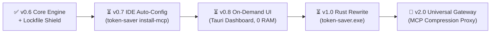

# 🗺️ Token-Saver Strategic Roadmap: From Local Engine to Universal Standard

> **Vision:** Zero-cost, zero-latency token optimization engine and intelligent MCP middleware for AI coding assistants.

---

## 📍 Execution Milestones & Roadmap

---

## 🏆 Completed Milestones (Current Production: v0.6)

### ✅ Multi-Language AST Skeletonizer
- Multi-language AST parsing across 130+ languages (Python, TS/JS, Go, Rust, Java, C++, Ruby, PHP).
- Extracts class signatures, method docstrings, and contracts while pruning implementation bodies.
- **Measured: 80% - 85% token reduction (3-4 ms latency).**

### ✅ Session-Level & Persistent L2 Cache with Semantic Diffing
- First read caches AST and tokens in SQLite; subsequent reads detect modifications and return surgical unified diffs.
- Automatic detection of small files to avoid diff bloat.
- **Measured: 91% - 93% token reduction on file re-reads.**

### ✅ Global Symbol Index & Blast Radius Engine
- SQLite FTS-indexed symbol lookup across classes, functions, and methods.
- `find_symbol_references`: Instant caller and import graph discovery across entire repos, eliminating the need to read 6-10 caller files.
- **Measured: 94.6% - 96.0% token reduction on refactoring and exploration.**

### ✅ Test & Terminal Output Pruner
- Specialized filters for `pytest`, `npm test`, `cargo test`, `jest`, and `git`.
- Strips thousands of repetitive passing logs (`.`, `PASS`), retaining only critical error traces and summary metrics.
- **Measured: 77.5% - 89.6% token reduction (0.7 ms filter overhead).**

### ✅ 🛡️ Lockfile & Giant Asset Shield *(NEW in v0.6)*
- Intercepts accidental reads of massive lockfiles (`package-lock.json`, `Cargo.lock`, `poetry.lock`, `yarn.lock`, `pnpm-lock.yaml`, `composer.lock`, `*.min.js`).
- **Surgical Package Query:** AI can query a specific package via `read_file_smart(file_path="...", query="<package_name>")` to get the exact 5-line version block instead of 50,000 lines.
- **Structural Summary:** Returns package counts and direct dependencies when no query is passed.
- **Zero-Block Escape Hatch:** Passing `force_full=True` returns raw full content with zero censorship.
- **Measured: 95.5% - 99.8% token reduction (eliminates 50k-100k token context compaction blowouts).**

---

## ⏳ Upcoming Milestones

### Phase 1: Zero-Friction IDE MCP Auto-Registration (`token-saver install-mcp`)
- **Problem:** Developers dislike manually editing JSON configuration files to connect MCP servers.
- **Goal:** One command or UI click to configure all installed IDEs.
  - Automatically locates and registers Token-Saver into:
    - **Claude Desktop:** `%APPDATA%\Claude\claude_desktop_config.json` / `~/Library/Application Support/Claude/`
    - **Cursor:** `~/.cursor/mcp.json` and `.cursor/mcp.json`
    - **Windsurf:** `~/.codeium/windsurf/mcp_config.json`
    - **VS Code Extensions (Cline / Roo / Continue):** `mcp_settings.json`
  - Safe `.bak` backup before any write operation.
  - Atomic writing to prevent JSON corruption.

### Phase 2: On-Demand Control & Settings Dashboard (Tauri v2)
- **Problem:** Desktop apps that run permanently in the background consume RAM and add mental clutter.
- **Design Philosophy:** **On-Demand Only (Zero Background RAM)**.
  - Runs like `git gui` or `prisma studio`: launches on `token-saver ui` or desktop shortcut, performs configuration/viewing, and fully terminates when closed.
  - **Features:**
    - Live savings counter (Cumulative tokens & dollars saved).
    - Big Master ON/OFF toggle switch.
    - One-click "Install into IDEs" button.
    - Project rule manager (toggle `AGENTS.md`, `.cursorrules`, `CLAUDE.md`).
    - Cache & Lockfile shield settings.

### Phase 3: The Rust Transformation (`token-saver.exe`)
- **Problem:** Python requires runtime installation (Python 3.10+, pip, virtualenv, PATH configuration).
- **Goal:** High-performance, self-contained single binary executable.
  - **Zero Dependency:** Single `token-saver.exe` (~10-15 MB). No Python, no virtualenvs.
  - **Microsecond AST Engine:** Native `tree-sitter` and `similar` crates. Monorepo indexing in < 30ms.
  - **Minimal Memory Footprint:** 10-15 MB RAM (down from Python's 80-150 MB).
  - Cross-platform CI/CD releases for Windows, Linux, and macOS (x86_64 and Apple Silicon).

### Phase 4: V2 Universal MCP Gateway & Compression Proxy
- **Vision:** "Cloudflare for MCP" — Intelligent middleware between the IDE and third-party MCP servers.
  - **JSON-RPC Multiplexing Reverse Proxy:** Connect IDE to Token-Saver; Token-Saver proxies to Postgres, Snowflake, GitHub, Slack MCP servers.
  - **Tabular Data Squeezer (SQL / DB Pruner):** Compresses 10,000 raw database rows into top-5 markdown tables + statistical distribution (98% token reduction on SQL queries).
  - **Deep Metadata Stripper:** Strips avatars, raw binary blobs, and redundant schema URLs from Jira/Slack/GitHub MCP payloads.
  - **Circuit Breaker Ceiling:** Hard token ceilings (e.g. 2,500 tokens max per tool call) preventing rogue MCP tools from blowing up LLM context.
