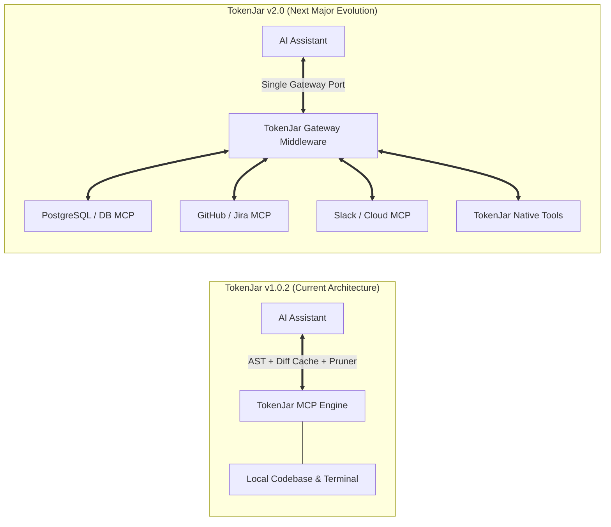
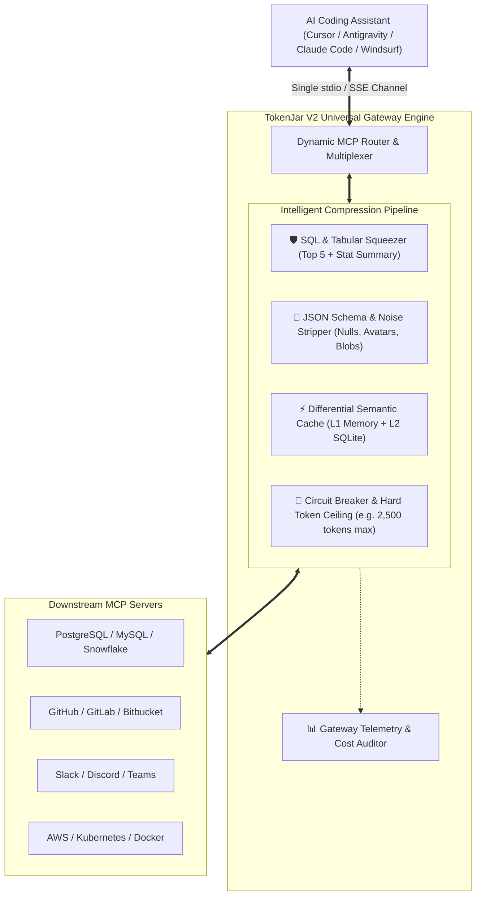

# 🍯 TokenJar V2.0: Universal MCP Gateway & Intelligent Compression Proxy

## 💡 The Vision: "Cloudflare for the MCP Ecosystem"
As the Model Context Protocol (MCP) becomes the universal standard for AI coding assistants and enterprise agents, a critical bottleneck has emerged: **third-party MCP servers are built for data access, not LLM token economy.**

TokenJar V2.0 transforms TokenJar from a standalone local file/terminal optimizer into an **Intelligent MCP Proxy Gateway** that intercepts, filters, and compresses tool responses between AI assistants and downstream MCP servers.

---

## 🎯 The Core Problem in V1 vs V2

### Why V2 is Essential:
1. **Unbounded Data Dumps:** A simple `SELECT * FROM users` via PostgreSQL MCP returns 10,000 JSON rows, destroying context windows and costing $2–$5 per prompt.
2. **Metadata Pollution:** Slack, Jira, and GitHub MCP responses are filled with avatar URLs, permission trees, nested nulls, and internal IDs that LLMs never need.
3. **IDE Connection Limit:** Configuring 15 different MCP servers in Cursor, Windsurf, Claude Code, and Antigravity leads to config bloat and process contention.

---

## 🏗️ TokenJar V2 Architecture Blueprint

---

## 🔑 Key Features Planned for V2.0

### 1. 🗄️ SQL & Tabular Squeezer (95–99% Savings)
- Intercepts tabular datasets from database MCP servers.
- Automatically renders a compact Markdown table containing the **first 5 rows + statistical distribution** (total rows, column types, min/max, null counts).
- LLMs get full structural insight without paying for 50,000 repetitive data rows.

### 2. 🧹 Universal JSON Metadata Stripper (40–70% Savings)
- Cleans nested JSON responses before sending to the model:
  - Prunes empty strings, `null` fields, and boolean defaults.
  - Strips image URLs, profile icons, and base64 payloads.
  - Collapses verbose schemas into concise TypeScript-like type definitions.

### 3. 🚨 Token Budget Guard & Circuit Breaker (100% Budget Protection)
- Set hard limits per tool call (e.g. max 2,500 tokens).
- If a downstream tool generates runaway output, TokenJar gracefully caps it with a concise summary and offers paginated access (`offset`, `limit`).

### 4. 🔌 Single-Pipe Multiplexing
- Instead of adding 10 MCP servers to Cursor or Claude Code, add **just one**: `tokenjar gateway`.
- TokenJar transparently manages child server processes, routing requests to the appropriate downstream MCP server based on tool namespace (`postgres:query`, `github:issue`).

### 5. 📈 Enterprise Cost & Savings Analytics
- Enhanced Web Dashboard (`tokenjar ui`) displaying:
  - Per-tool token consumption breakdown.
  - Real-time financial savings per model (Claude 3.5 Sonnet, GPT-4o, Gemini 1.5 Pro).
  - Configurable compression rules per server.

---

## 📅 Roadmap & Milestones

- **Phase 1: Gateway Core & Router** — Subprocess multiplexer over stdio/JSON-RPC.
- **Phase 2: Tabular & JSON Filter Pipeline** — SQL summarizer and metadata stripper.
- **Phase 3: Rate Limiting & Circuit Breaker** — Hard token ceiling guards.
- **Phase 4: Web UI Gateway Configuration** — 1-Click downstream server management.
- **Phase 5: Release v2.0 GA** — Crates.io, PyPI, Homebrew, and Winget updates.

---
*Preserved for future development. Created: September 2026.*
